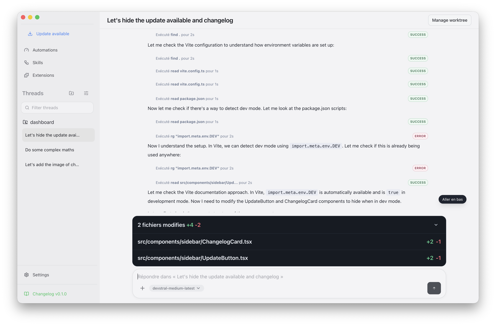

# Chatons

**Your desktop AI workspace for code, conversations, and projects.**

[Download](#download) · [Features](#features) · [Getting Started](#getting-started) · [Documentation](#documentation)

---

 

Chatons is a native desktop app that brings AI-powered coding, writing, and project management into one elegant workspace. Connect any model provider, organize conversations by project, and let the assistant read, edit, and run code directly in your repositories.

**All your data stays on your machine.** No cloud sync, no telemetry by default.

---

## Features

<table>
<tr>
<td width="50%">

### 🧠 Multi-Provider AI
Connect OpenAI, Anthropic, Ollama, LMStudio, or any OpenAI-compatible API. Switch models per conversation. Use cloud or fully local.

</td>
<td width="50%">

### 💻 Code Natively
The assistant reads files, makes precise edits, and executes commands directly in your project. Review diffs inline before accepting changes.

</td>
</tr>
<tr>
<td>

### 📂 Project-First Organization
Link conversations to Git repositories. Each project gets its own threads, context, and optional worktrees for isolated branch work.

</td>
<td>

### 🔌 Extensions & Automations
Install extensions for Telegram, Slack, and more. Create automation rules triggered by app events. Build your own with a simple API.

</td>
</tr>
<tr>
<td>

### 🧩 Skills Marketplace
Browse and install reusable AI skills. Extend what your assistant can do without writing any code.

</td>
<td>

### 🔒 Privacy by Design
Everything runs locally. API keys stay on your machine. Telemetry is opt-in. Your conversations are never sent anywhere except to your chosen provider.

</td>
</tr>
</table>

---

## Download

Get the latest version from [GitHub Releases](https://github.com/thibautrey/chaton/releases/latest):

| Platform | Download |
|----------|----------|
| **macOS** (Apple Silicon & Intel) | [`.dmg` installer](https://github.com/thibautrey/chaton/releases/latest) |
| **Windows** (x64) | [`.exe` installer](https://github.com/thibautrey/chaton/releases/latest) |
| **Linux** | [`.AppImage`](https://github.com/thibautrey/chaton/releases/latest) |

---

## Getting Started

1. **Download & install** Chatons for your platform
2. **Add a provider** — OpenAI, Anthropic, Ollama, or paste any compatible API URL
3. **Pick your models** — Star the ones you want in your picker
4. **Start a conversation** — Ask questions, write code, debug issues

For project workflows, import a Git repository and create project-scoped threads with full repo context.

---

## Documentation

| Doc | Description |
|-----|-------------|
| [User Guide](docs/CHATONS_USER_GUIDE.md) | Feature walkthrough and everyday workflows |
| [Developer Guide](docs/CHATONS_DEVELOPER_GUIDE.md) | Architecture, setup, and contributing |
| [Extensions](docs/EXTENSIONS.md) | Build custom extensions |
| [Automations](docs/AUTOMATION_EXTENSION.md) | Create event-driven automation rules |

---

## Contributing

Contributions are welcome! See the [Developer Guide](docs/CHATONS_DEVELOPER_GUIDE.md) for setup instructions.

---

**MIT** &copy; Thibaut Rey

[Issues & Feedback](https://github.com/thibautrey/chaton/issues)

