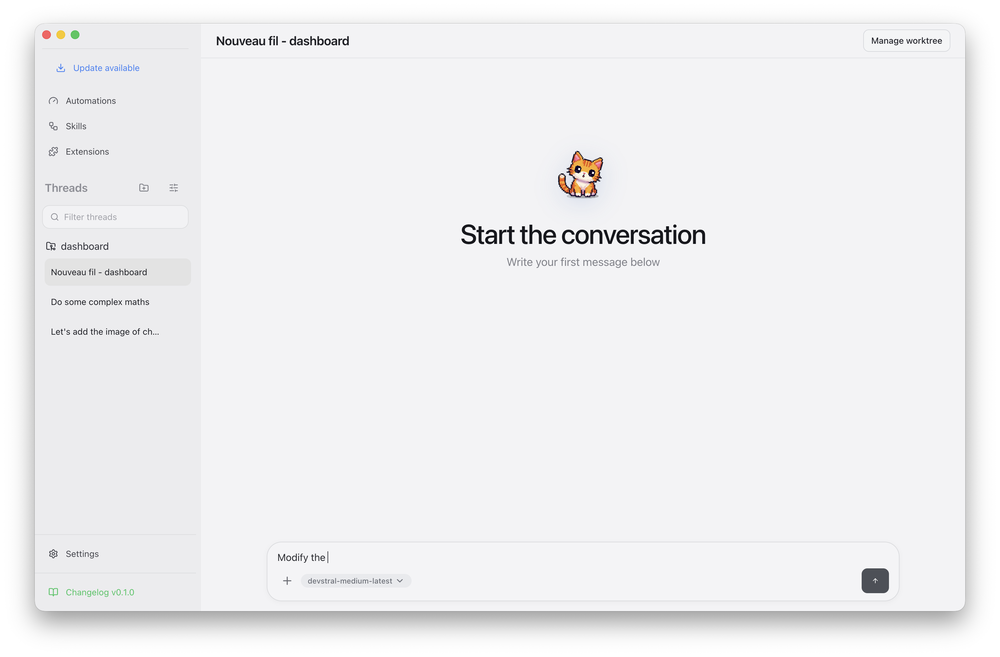

# Chatons

  

  <strong>Your personal AI assistant</strong> 
  Intelligent conversations • Multi-provider AI models • Seamless workflow integration

  
  

---

## ✨ What Chatons Does

Chatons brings the power of artificial intelligence to your desktop with a beautiful native experience:

### Intelligent Conversations
- Have natural conversations with AI assistants
- Get answers, explanations, and creative ideas instantly
- Maintain context across multiple conversation threads
- Organize discussions by projects and topics

### Multi-Provider AI Access
- Connect to multiple AI providers from one interface
- Seamlessly switch between different AI models
- Access cutting-edge language models and coding assistants
- Manage your preferred models and providers easily
- **Recommended**: Mistral Devstral models for optimal performance based on our experience

### Seamless Workflow Integration
- Native desktop application with system integration
- Quick access from your dock, taskbar, or menu
- Beautiful, distraction-free interface
- Works offline with local configuration fallback

### Powerful Features
- **Conversation History**: Keep track of all your AI interactions
- **Project Organization**: Group conversations by projects
- **Model Management**: Choose from multiple AI providers and models
- **Settings Synchronization**: Your preferences follow you across devices

---

## 🖼️ Screenshot Gallery

### Main Conversation Interface

### Coding Session

### Simple Conversation

---

## 🚀 Getting Started

### Download and Install

Get the latest version of Chatons from our releases page:

📥 [Download Chatons](https://github.com/thibautrey/chaton/releases)

### First Launch
1. Download the installer for your platform
2. Run the installation package
3. Open Chatons from your applications menu
4. Select your preferred AI models
5. Start chatting instantly
6. Organize conversations by projects

---

## 🎯 Use Cases

### For Developers
- Get coding assistance and explanations
- Debug and optimize code
- Learn new programming concepts
- Generate documentation and comments
- **Pro Tip**: Mistral Devstral models excel at code-related tasks

### For Writers
- Overcome writer's block
- Get creative ideas and suggestions
- Improve your writing style
- Generate content outlines

### For Researchers
- Summarize complex topics
- Find relevant information quickly
- Get explanations for technical concepts
- Organize research by projects

### For Everyone
- Quick answers to everyday questions
- Learning new skills and concepts
- Brainstorming ideas
- Productivity enhancement

---

## 💡 Why Chatons?

### Beautiful Native Experience
- Designed for your platform
- Clean, modern interface
- Smooth animations and transitions
- System integration

### Powerful Yet Simple
- Complex AI capabilities
- Simple, intuitive interface
- No technical knowledge required
- Works right out of the box

### Privacy Focused
- Local configuration options
- Clear data management
- Offline capabilities
- Your conversations stay private
- Mistral Devstral models provide excellent performance while respecting privacy

### Always Improving
- Regular updates
- New AI models added frequently
- Community-driven development
- Open source and transparent

---

## 📈 Star History

---

## 🤝 Join the Community

Chatons Native is an open source project that thrives on community contributions:

- **Report issues** and suggest features on GitHub
- **Contribute code** to help improve the application
- **Share your ideas** for new capabilities
- **Help with documentation** and tutorials

---

## 📄 License

MIT © Thibaut Rey

---

## 🌟 What Users Are Saying

> "Chatons has transformed how I work with AI - it's always there when I need it!"

> "The native macOS integration makes it feel like part of the system."

> "Finally, an AI assistant that respects my privacy and works offline."

---

## 🚀 Roadmap

### Coming Soon
- Windows and Linux support
- Mobile companion apps
- Advanced conversation search
- Custom AI model training
- Plugin system for extended functionality

### Long Term Vision
- Seamless cross-device synchronization
- Voice interaction support
- Advanced workflow automation
- Enterprise team features
- Educational institution integration

---

## 📚 Learn More

- [Implementation Details](IMPLEMENTATION_SUMMARY.md)
- [Pi Integration Guide](PI_INTEGRATION.md)
- [Extensions Guide](EXTENSIONS.md)
- [Development Documentation](AGENTS.md)

---

**Ready to experience the future of AI assistance?**

[Download Chatons](#-getting-started) and start your intelligent conversation journey today!
